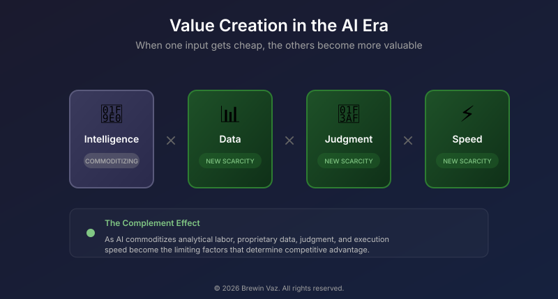
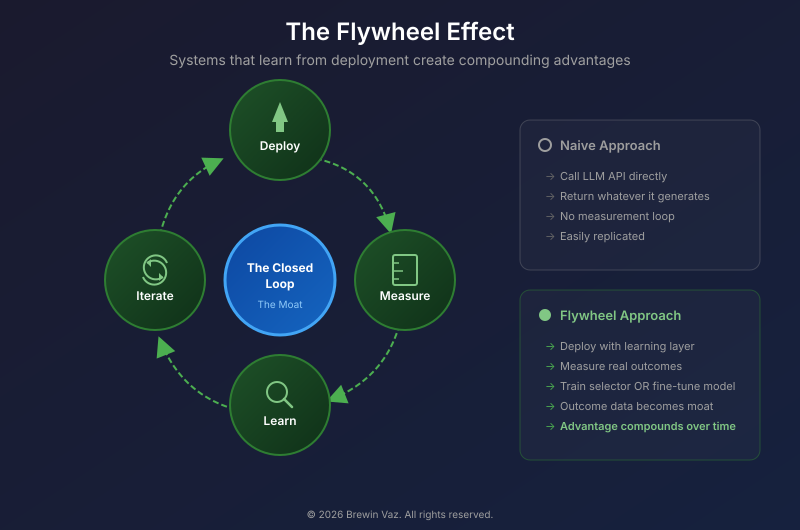
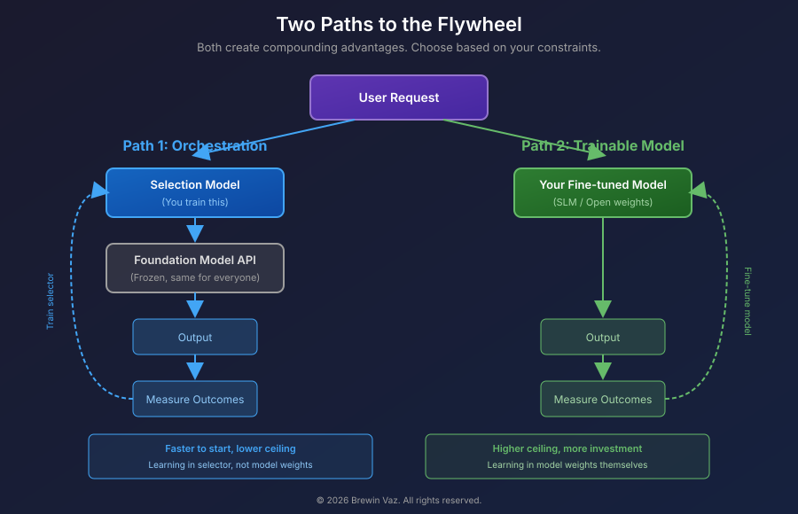

# When Everyone Has AI

You're building AI workflows and solutions. So is your competitor. So is the startup that didn't exist last year. If everyone has access to the same intelligence, the question isn't whether you're using AI. It's whether you're using it in ways others can't copy.

## The Jevons Paradox

In 1865, an economist named William Stanley Jevons noticed something weird. Steam engines were getting more efficient. You'd think this would mean England would burn less coal. Instead, coal consumption exploded. Efficiency didn't reduce demand. It unlocked applications that hadn't made economic sense before.

This keeps happening. Make something cheap, people use more of it. Make computation cheap, you get the internet. Make communication cheap, you get social media. Make sequencing cheap, you get consumer genomics.

We're doing this with intelligence now. When analytical labor commoditizes, you don't do less analysis (I use analysis broadly to cover several jobs and functions such as consulting, software engineering, business intelligence etc.). You do vastly more. History suggests this also creates roles we can't yet name; the internet gave us "social media manager" and "SEO specialist," jobs that would have been incomprehensible in 1995. The bottleneck moves somewhere else. The interesting question is, where?

## A simple model

Think about value creation as a function of a few inputs:

- Intelligence (the raw analytical horsepower)
- Data (the context and information you're working with)
- Judgment (knowing what's worth doing)
- Execution speed (how fast you close the loop)

One concept will come up repeatedly: *ground truth*. This is data that reflects actual outcomes in the physical world, distinct from the probabilistic predictions of a model. Did the customer actually convert? Ground truth is expensive to collect because it requires waiting for reality to unfold and building systems that can observe it reliably. Call this *Ground Truth Scarcity*; the constraint that matters when analytical labor is abundant.

Before LLMs, general-purpose analytical labor was expensive.If you could afford more headcount, you had an advantage.

Now that work is commoditizing. Not everywhere, not completely; requirements like security, reliability, and performance still matter, and so do the people who understand them. But for a lot of analytical work, the floor is dropping. Summarization, copywriting with research, first-draft code; tasks that once required your full attention now happen in the background.

When one input gets cheaper, its complements get more valuable. Clayton Christensen called this the Law of Conservation of Attractive Profits. When one layer commoditizes, an adjacent layer captures the margin. Ben Thompson has documented this pattern across every major tech transition; hardware to software, distribution to aggregation, content to curation. The profits don't disappear. They migrate.

So the bottleneck moves. What you know that others don't. The judgment to act on it. How fast you can close the loop. These are the limiting reagents now; and they're harder to hire for than raw analytical ability ever was.

> **The thesis:** When intelligence commoditizes, value shifts to what remains scarce. Proprietary data. Ground truth evaluation. The judgment to deploy AI well.
>
> Two frameworks help navigate this shift:
> - *Ground Truth Scarcity*: Some human capabilities become more valuable when AI arrives, not less. They provide the reality-check AI cannot generate.
> - *Outcome Systems*: The architecture that compounds advantage. Deploy, measure against reality, learn, iterate.
>
> The companies that build these feedback loops will pull ahead. The rest will compete on price for the same commodity.

## What history suggests

When Gutenberg's press spread across Europe, printing commoditized within fifty years. Value shifted to those who knew what to print: publishers, curators, distributors. Same story with the internet; hosting and bandwidth got cheap, so Google (discovery), Amazon (aggregation), and Facebook (network effects) captured the value. Infrastructure commoditized. Complements won.

I'd bet money the AI era follows a similar pattern. Foundation models are becoming infrastructure. The value will likely accrue to those who control what makes the models useful; proprietary context, feedback loops, and the judgment to deploy them well.

There's a counterargument worth taking seriously: synthetic data is already working in formally verifiable domains. Code compiles or it doesn't. Math proofs check or they don't. In these areas, AI-generated training data is genuinely replacing human ground truth.

But there's a distinction that matters. In verifiable domains, truth is objective; the answer exists independent of anyone observing it. In social domains, truth is intersubjective; created in the interaction, not discovered from pre-existing data. You can simulate a customer, but real customers adapt. They develop resistance to patterns that worked last quarter. If your AI learns to model customers while customers use AI to model vendors, you're in adversarial co-evolution with no static distribution to learn from.

The human feedback moat persists where formal verification fails, where ground truth is created rather than discovered, and where consequences require accountability. That's the residual scarcity.

## The people question, actually answered

If intelligence is commoditizing, what happens to the people who used to provide it? The fear is rational. Layoffs are real. Some roles will be eliminated. The honest framing isn't "AI won't take your job." It's "here's what will still matter, and here's what you can do about it."

Some human capabilities become *more* valuable when AI handles routine work, not less. AI may mean fewer roles overall, but the roles that remain are harder to fill and matter. Organizations that treat AI adoption as purely a technology project, without investing in their people, will struggle to capture the value. The efficiency gains shouldn't accrue solely to shareholders while workers bear the transition costs.

Developing new capabilities takes time, energy, and often money that not everyone has equally. These aren't personal failures; they're structural constraints. Policy, employer investment, and social safety nets matter too. The capabilities described below aren't innate talents. They're skills that can be developed.

**Evaluation against ground truth.** LLMs produce outputs that match the surface patterns of quality work. They're fluent and plausible, but often wrong in ways that aren't obvious unless you know the domain.

The person who reads AI-generated analysis and says "this is plausible-sounding but actually wrong because..." is doing work the AI cannot do. Not because the AI lacks intelligence, but because it lacks access to ground truth. It doesn't know what actually happened when you deployed that feature, or which vendor relationships are actually functional versus nominally functional.

Domain experts who can evaluate outputs against reality become more valuable, not less. This isn't limited to senior positions. A customer service rep who notices the AI keeps mishandling refund edge cases is doing evaluation work. A junior analyst who realizes the AI's market sizing assumes outdated demographics is catching errors that compound. The common thread isn't seniority; it's proximity to reality the AI can't see.

A related skill: prompting for variance. A good evaluator doesn't just check the first output. They ask for five radically different approaches, then evaluate which framing reveals something the default would have missed.

**Problem selection.** In optimization, there's a difference between local and global optima. Gradient descent finds local optima efficiently. It follows the slope downhill. But it gets stuck in valleys that aren't the deepest point on the landscape.

Companies do this constantly. They optimize metrics that don't matter. They ship features nobody wanted. They solve problems that aren't the real constraint. AI accelerates this. It makes you faster at climbing whatever hill you're on. It doesn't tell you if it's the right hill.

There's a real risk here that AI feedback loops make this worse. You optimize for engagement, the model learns what drives engagement, you get more of what the model thinks engagement looks like. The metric becomes the target, the target becomes the optimization surface, and you drift away from the thing you actually cared about. Goodhart's Law, accelerated.

The most documented case is Instagram. Internal research leaked by whistleblower Frances Haugen showed that Instagram's engagement-based algorithms learned to amplify content that triggered negative emotions in teenage users; body image content kept users scrolling longer. Facebook's own research found that "thirty-two percent of teen girls said that when they felt bad about their bodies, Instagram made them feel worse." Engagement metrics looked great while user wellbeing deteriorated. The algorithm found a local optimum that was globally disastrous.

The same dynamic plays out in enterprise settings. A sales team optimizes for "emails sent per day" because it's easy to measure. Activity metrics soar, but reply rates drop as prospects learn to pattern-match AI-generated outreach. The metric looked great; the pipeline didn't. When every competitor deploys the same optimization, the problem compounds across the ecosystem; a dynamic we'll return to in the conclusion.

The people who can step back and ask "wait, should we even be doing this?" are more valuable now. Not less. But they also need the organizational standing to actually redirect resources, which is a structural question, not just a talent question.

**Accountability and meaning.** AI can predict a number, but only a human understands what that number *means*; to a relationship, a brand reputation, a team's morale. Accountability isn't just about having someone to blame when things go wrong. It's about having someone who *cares* about the outcome in ways that shape how decisions get made. And just as the human takes the blame for the crash, the human also gets the credit for the breakthrough. An AI cannot be promoted; it cannot build a reputation. Accountability is the mechanism that allows humans to capture the upside of their judgment.

That said, the legal structures matter too. When an AI-assisted radiology system misses a diagnosis, the malpractice suit names the physician, not OpenAI. When an algorithmic trading system causes losses, regulators want to talk to a human. The EU AI Act explicitly requires meaningful human oversight for high-risk applications. These aren't philosophical preferences; they're legal structures that create demand for humans who can credibly say "I reviewed this and take responsibility."

The legal profession learned this the hard way. In 2023, attorney Steven Schwartz submitted a brief citing six cases that didn't exist; ChatGPT had generated plausible-sounding precedents complete with fake quotes. The judge fined the lawyers $5,000. The AI had no duty. Schwartz did. That duty couldn't be delegated to a language model, and accountability landed exactly where it always does: on the human who signed the brief.

## Flywheels, concretely

Humans remain essential for evaluation, judgment, and accountability. But these capabilities don't create value in isolation; they need to be embedded in systems that capture and amplify them. The people who matter most in the AI era are the ones whose judgment gets encoded into systems that learn.

If data and feedback loops are the new moat, the strategic implication is obvious: build systems that learn from their own operation.

A common objection here: "We don't have access to the model weights. We can't fine-tune the foundation model. So how do we actually learn?"

You don't need to touch the foundation model. **The learning happens at the orchestration layer.**

Intercom's Fin AI agent demonstrates this concretely. Intercom reports resolution rates improving from roughly 25% at launch in 2023 to approximately 66% by late 2025, with continued incremental gains. The foundation models haven't changed dramatically (I say this loosely); what changed is the orchestration layer. Fin learns from human agent behavior, feeds successful resolutions back into training, and continuously improves matching between question types and response strategies.

Vercel has publicly reported autonomous resolution rates approaching 85-90% on support cases. But the more interesting part is what happens to the tickets that remain. CEO Guillermo Rauch describes a system where tickets that can't be resolved through guidance get triaged by an AI PM and routed to coding agents. Customer reports a product defect? That becomes a code change. The support flywheel doesn't just resolve tickets; it improves the product.

Duolingo runs a similar loop. Their Birdbrain system optimizes exercise difficulty in real-time based on learner performance. With 500 million learners, they collect more interaction data daily than competitors collect in months. Duolingo has reported double-digit improvements in learner retention tied to adaptive exercise difficulty.

None of these companies is doing anything exotic with the underlying models. They're measuring outcomes, feeding signals back into selection logic, and iterating. The moat isn't the AI. It's the closed loop.

Two companies using the same foundation model can end up in very different places. One builds an *Output System*: it generates content, code, or analysis. The other builds an *Outcome System*: it generates outputs, measures them against reality, and learns. This is the core distinction from the thesis; over time, the gap compounds.

The difference is permission to act. An AI that drafts an email is an Output System. An AI that sends it and measures the reply rate is an Outcome System. The closed loop requires agency, not just analysis. This is what "execution speed" from the simple model means in practice: not just moving fast, but closing the loop fast enough to learn.

> **The Outcome System Framework**
>
> | Output System | Outcome System |
> |---------------|----------------|
> | Generates content, code, analysis | Generates + measures + learns |
> | Permission to suggest | Permission to act |
> | Static capability | Compounding advantage |
>
> *Deploy → Measure → Learn → Iterate*

Everything so far assumes you're building systems around foundation models you don't control. There's another path emerging.

## The deeper moat: trainable models

Instead of building an orchestration layer around a frozen API, you can run your own model and train it directly on your outcome data.

Open-weight models have gotten remarkably capable. Smaller models, sometimes called SLMs (small language models), can match frontier model performance on narrow tasks when fine-tuned well. The economics favor them for production workloads: faster inference, cheaper fine-tuning, and you own the weights.

This changes the flywheel architecture. Instead of training a selector that chooses how to use a frozen model, you train the model itself. The outcome data from your deployments becomes fine-tuning signal. After enough iterations, you have a model that does your specific task better than any general-purpose alternative, because it learned from your users, your edge cases, your distribution of inputs.

**Choosing your path:**

The decision between orchestration and trainable models isn't about capability. It's about where you are today and where you're headed.

| Factor | Orchestration | Trainable Models |
|--------|--------------|------------------|
| Data volume | <100K examples | >100K examples |
| Latency needs | Flexible (100ms+) | Sub-100ms required |
| Annual budget | <$200K/year | $500K+ available |
| Time to value | Weeks | Months |
| ML team | Not required | Required |
| Moat depth | Shallow to medium | Deep |

Most organizations should start with orchestration. It's faster, cheaper, and lets you validate the product before committing to infrastructure.

The flywheel logic is the same either way. Deploy, measure, learn, iterate. The question is just where the learning accumulates: in your selector or in your model weights.

Whether you choose orchestration or trainable models, the goal is the same; a system that learns. The next question is how this shows up in the numbers.

## The economics: what this means for your P&L

The strategic logic is clear. Here's what it looks like on a P&L.

**Cost structure shift**

McKinsey Global Institute estimates that AI can deliver cost reductions of up to 40% across various sectors, with 30% savings in labor costs for knowledge work. In software engineering, manufacturing, and IT, organizations report 10-20% cost reductions tied to AI adoption. The shift moves spend from fixed costs (salaries) to variable costs (API calls and compute).

"Labor cost savings" is a euphemism, and we both know what it often means. In high-performing organizations, cost reduction comes from shifting people to higher-leverage work. But not every CFO reads it that way, and the spreadsheet won't tell you what it costs to lose institutional knowledge.

A realistic caveat: these savings follow a J-curve. Most organizations see costs *rise* initially as they dual-run existing systems alongside AI implementations, train staff, and work through integration friction. The 10-20% reductions materialize after stabilization, typically 12-18 months in. The CFOs who expect immediate margin expansion will be disappointed; the ones who plan for an investment trough will capture the eventual savings.

**Defining "high-leverage" work**

The most common objection from executives is skepticism about what this new "high-leverage work" actually is. If you can't name the specific tasks that replace the old ones, the 30% savings will inevitably turn into a headcount reduction target.

You need to map the shift concretely. When AI handles the "output," the human role shifts to "outcome management."

| Role | The Commoditized Task (AI does this) | The High-Leverage Pivot (Human does this) |
|------|--------------------------------------|-------------------------------------------|
| **Software Eng** | Writing boilerplate code, unit tests, and documentation. | **System Architecture & Review:** Reviewing AI-generated code for security flaws, designing complex integrations, and managing "technical debt" before it starts. |
| **Marketing** | Writing 50 variants of SEO copy or email subject lines. | **Orchestration:** Designing the customer journey logic, selecting the emotional "hook," and auditing the AI's brand voice compliance. |
| **Customer Support** | Answering "Where is my order?" and password resets. | **Root Cause Analysis:** Analyzing *why* 500 people asked about their order today and working with Logistics to fix the upstream shipping error. |
| **Sales** | Writing cold outreach emails and summarizing calls. | **Relationship Strategy:** Interpreting the "unsaid" hesitation in a prospect's voice and navigating the complex internal politics of the buyer's organization. |
| **Legal/Compliance** | Reviewing standard NDAs and contracts. | **Risk Judgment:** Deciding which non-standard clauses are acceptable risks to take to close a strategic partnership. |

The pattern is consistent: the human moves from *production* (creating the artifact) to *orchestration* (designing the system that creates the artifact) and *risk management* (deciding if the artifact is safe to use).

This creates reinvestment capacity. The question is where to deploy it.

**The value multiplier effect**

When intelligence commoditizes, proprietary data value increases by multiples. Consider the companies that have made this tangible.

Tesla reports billions of real-world driving miles collected from its fleet. Each mile contains sensor readings and edge cases competitors would need years to accumulate. Netflix's recommendation engine drives 80% of content watched on the platform; the company estimates this personalization saves roughly $1B per year in reduced churn. Spotify's listening behavior feeds personalized playlists that drive retention, creating a data flywheel competitors can't easily replicate.

The pattern is consistent: data that seemed like a byproduct becomes the core asset when analytical intelligence is no longer the constraint.

**Build vs. buy economics**

| Approach | Timeline | Relative Cost | Moat Depth |
|----------|----------|---------------|------------|
| Simple orchestration (basic RAG) | 1-4 weeks | $ | Shallow-Medium |
| Hybrid (orchestration → fine-tuning) | 3-9 months | $$-$$$ | Medium-Deep |
| Full training pipeline | 6-12 months | $$$$ | Deep |

**ROI reality check**

MIT's 2025 report "The GenAI Divide" found that a large majority of AI pilots had not yet produced measurable P&L impact, despite $35-40 billion in US business investment. The pattern: projects that remained static without feedback loops. Among projects that do succeed, Deloitte's research shows most achieve satisfactory ROI within two to four years, and an IDC study found companies average $3.50 in value for every $1 spent on AI.

The organizations that treat AI cost savings as margin expansion are missing the point. The ones that reinvest into feedback infrastructure are building the moats.

## A roadmap for upskilling

You can't just tell people to "be more strategic." Organizations that successfully shift 30% of effort to high-leverage work do it through structured intervention.

**Phase 1: The Literacy Baseline (Weeks 1-4).** Conduct mandatory hands-on workshops where every employee uses AI to solve a real problem in their day job. The goal is demystifying the tools; once people understand the difference between prompting and magic, the psychological barrier drops.

**Phase 2: The "Champion" Pilots (Months 2-3).** Pick 1-2 champions in every department. Give them explicit permission to redesign one core workflow using AI. This produces a library of wins specific to your data and customers.

**Phase 3: Workflow Redesign (Months 4-6).** Rewrite job descriptions. Stop measuring activity (lines of code, emails sent) and start measuring outcomes (bugs preventing release, conversion rate). The 30% savings get formally reallocated to new projects.

**Phase 4: The Governance Layer (Ongoing).** Establish human-in-the-loop protocols. Who signs off on the AI's work? Who owns the liability? Accountability is clear. You have built an Outcome System, not just a collection of tools.

## What this means

General-purpose analytical labor is commoditizing. This changes what matters.

Proprietary data matters more. Judgment matters more. Speed matters more. The ability to build feedback loops that learn from deployment matters more.

"People" matter, but the specific human capabilities that matter are shifting. Not raw analytical horsepower. Evaluation against ground truth, problem selection, accountability, and the organizational structures that let these capabilities actually influence decisions.

The companies that figure this out will compound their advantages. The ones that deploy AI without building feedback loops will find themselves with the same commodity as everyone else.

There's a collective action problem lurking here. If every company builds Outcome Systems optimizing for engagement, users get inundated. The "emails sent per day" example scales to an ecosystem level: everyone optimizes, everyone sends more, everyone's signal degrades. User attention may become the ultimate scarcity; not just for any single company, but for the system as a whole. The Tragedy of the Commons, accelerated by AI. The winners in that environment won't be the ones who optimize hardest. They'll be the ones who earn permission to occupy scarce attention by actually delivering value.

The transition is ongoing and the equilibrium isn't clear. Some of what I'm calling "human advantages" might turn out to be automatable in ways I'm not anticipating. But the structural logic of complements seems robust: when one input gets cheap, value shifts to what remains scarce. The skills that matter now are different from the ones that mattered five years ago, and they'll be different again five years from now. What's new is the pace of the shift; and organizations have a responsibility to invest in helping people navigate it. The companies that recognize this obligation will keep the trust of the people they need.

If you're an executive reading this, much of this transition ultimately sits at the leadership level. You're the one deciding whether AI adoption means investing in your people or extracting from them. You're the one choosing between "30% cost reduction" and "30% shift to higher-leverage work." The spreadsheet looks the same either way. The outcomes don't. The people who built your company are watching what you do next.

> **As Syndrome observed in *The Incredibles*: "When everyone's super, no one will be."**
>
> **When everyone has AI, AI isn't the differentiator. The closed loop and the human judgment that guides it is.**

---

## Sources and Further Reading

**Business Strategy and Economic Theory**
- [The Law of Conservation of Attractive Profits](https://stratechery.com/2015/netflix-and-the-conservation-of-attractive-profits/) - Stratechery (Ben Thompson)

**Data Flywheels and Competitive Advantage**
- [The AI Flywheel: How Data Network Effects Drive Competitive Advantage](https://hgbr.org/research_articles/the-ai-flywheel-how-data-network-effects-drive-competitive-advantage/) - Hampton Global Business Review
- [Building Your AI Data Moat](https://thedataguy.pro/blog/2025/05/building-your-ai-data-moat/) - TheDataGuy
- [Netflix AI Strategy for Dominance](https://www.klover.ai/netflix-ai-strategy-for-dominance/) - Klover.ai

**AI in Legal Practice**
- [Update on the ChatGPT Case: Counsel Who Submitted Fake Cases Are Sanctioned](https://www.seyfarth.com/news-insights/update-on-the-chatgpt-case-counsel-who-submitted-fake-cases-are-sanctioned.html) - Seyfarth Shaw LLP
- [As More Lawyers Fall for AI Hallucinations, ChatGPT Says: Check My Work](https://cronkitenews.azpbs.org/2025/10/28/lawyers-ai-hallucinations-chatgpt/) - Cronkite News

**Engagement Optimization and Platform Harms**
- [Frances Haugen Says Facebook's Algorithms Are Dangerous. Here's Why.](https://www.technologyreview.com/2021/10/05/1036519/facebook-whistleblower-frances-haugen-algorithms/) - MIT Technology Review
- [Whistleblower's Testimony Has Resurfaced Facebook's Instagram Problem](https://www.npr.org/2021/10/05/1043194385/whistleblowers-testimony-facebook-instagram) - NPR
- [Facebook Whistleblower Frances Haugen Testified That the Company's Algorithms Are Dangerous](https://theconversation.com/facebook-whistleblower-frances-haugen-testified-that-the-companys-algorithms-are-dangerous-heres-how-they-can-manipulate-you-169420) - The Conversation

**Orchestration Layer Learning**
- [What's New with Fin 3: The Best AI Agent for Complex Queries Across Every Channel](https://www.intercom.com/blog/whats-new-with-fin-3/) - Intercom Blog
- [Fin 2: The First AI Agent That Delivers Human-Quality Service](https://www.intercom.com/blog/announcing-fin-2-ai-agent-customer-service/) - Intercom Blog
- [Vercel Support Agent Resolution Rates](https://www.linkedin.com/posts/rauchg_weve-reached-an-all-time-high-of-876-autonomous-activity-7423497497089683456-aZAB/) - Guillermo Rauch, LinkedIn
- [How Duolingo's AI Learns What You Need to Learn](https://spectrum.ieee.org/duolingo) - IEEE Spectrum
- [Duolingo Research](https://research.duolingo.com/) - Duolingo

**AI Regulation and Accountability**
- [PwC 2026 AI Predictions](https://www.pwc.com/us/en/tech-effect/ai-analytics/ai-predictions.html) - PwC
- [Dark Patterns in AI-Enabled Consumer Experiences](https://casmi.northwestern.edu/research/projects/dark-patterns.html) - Northwestern University CASMI

**AI Cost and ROI Research**
- [The State of AI in 2025](https://www.mckinsey.com/capabilities/quantumblack/our-insights/the-state-of-ai) - McKinsey
- [AI ROI: The Paradox of Rising Investment and Elusive Returns](https://www.deloitte.com/global/en/issues/generative-ai/ai-roi-the-paradox-of-rising-investment-and-elusive-returns.html) - Deloitte
- [Generative AI Implementation Cost Breakdown](https://agentiveaiq.com/blog/how-much-does-generative-ai-cost-to-implement) - AgentiveAI
- [MIT Report: 95% of Generative AI Pilots Failing](https://fortune.com/2025/08/18/mit-report-95-percent-generative-ai-pilots-at-companies-failing-cfo/) - Fortune

**Tesla Fleet Data**
- [Tesla FSD Fleet Nears 7 Billion Miles](https://www.teslarati.com/tesla-fsd-fleet-nearing-7-billion-total-miles-including-2-5-billion-city-miles/) - Teslarati
- [Tesla Vehicle Safety Report](https://www.tesla.com/VehicleSafetyReport) - Tesla

**Netflix Personalization**
- [How Netflix Uses Personalization to Drive Billions in Revenue](https://www.rebuyengine.com/blog/netflix) - Rebuy

---

*Brewin writes about applied AI/ML, data infrastructure, and the intersection of AI/ML and business. The opinions expressed in this article are those of the author. This article was edited with LLM assistance for grammatical errors.*

